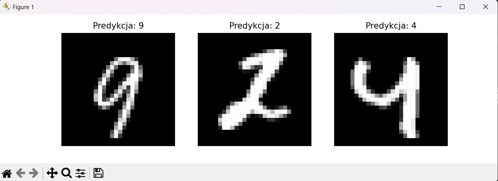

# Simple Neural Network

## Table of Contents
* [General Info](#general-information)
* [Technologies Used](#technologies-used)
* [Screenshots](#screenshots)
* [Setup](#setup)
* [Room for Improvement](#room-for-improvement)


## General Information
- A simple neural network whose task is to determine which handwritten number is present in the given image.

## Technologies Used
- Python 3.12
- Numpy 2.2.2

## Screenshots


## Setup
To run this project, install it locally using pip:

```
$ cd ../Simple_Neural_Network
$ pip install numpy
```
Download the data from the link below:
https://drive.google.com/file/d/1eEKzfmEu6WKdRlohBQiqi3PhW_uIVJVP/view

## Room for Improvement

To do
- Optimize the code
- Add new activation functions
- Better display of result